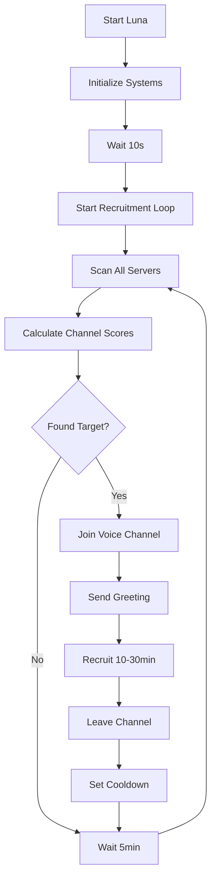

# Luna - Autonomous Discord Recruitment Bot

Luna is an advanced Discord self-bot designed for autonomous voice channel recruitment across multiple servers. She operates with a sophisticated AI-driven conversation system and strategic recruitment algorithms.

## 🎯 Key Features

### Autonomous Operation

- **Automatic Server Scouting**: Continuously scans all accessible Discord servers
- **Smart Channel Selection**: Identifies optimal voice channels (2-15 members) for recruitment
- **Natural Conversation**: AI-powered responses using Google Gemini for authentic interactions
- **Voice Generation**: High-quality French female voice using Microsoft Edge-TTS
- **Anti-Spam Protection**: Prevents duplicate invitations and manages cooldowns

### Strategic Recruitment

- **Multi-Server Operation**: Works across all servers Luna has access to
- **Intelligent Scoring**: Prioritizes channels based on member count and server size
- **Cooldown Management**: Avoids recently visited servers (2-hour cooldown)
- **Context-Aware Greetings**: Adapts initial messages based on channel type
- **Invitation Tracking**: Remembers who has been invited to prevent spam

### Voice & Communication

- **Edge-TTS Integration**: Realistic French female voice (BrigitteNeural)
- **Dynamic Response Types**: Switches between voice and text based on context
- **Conversation Memory**: Maintains context across interactions
- **Server Invitation System**: Automatically promotes your main server

## 🚀 Quick Start

### 1. Installation

```bash
git clone <repository>
cd ewhore-vocal
pip install -r requirements.txt
```

### 2. Configuration

Edit `config/settings.py`:

```python
DISCORD_TOKEN = "your_discord_token_here"
LUNA_SERVER_ID = "your_main_server_id"
LUNA_SERVER_INVITE = "https://discord.gg/your_invite"
GEMINI_API_KEY = "your_gemini_api_key"
```

### 3. Launch

```bash
python main.py
```

Luna will automatically:

- Connect to Discord
- Initialize the autonomous recruitment system
- Start scanning servers after 10 seconds
- Begin joining voice channels and recruiting

## 📋 Commands

### Basic Control

- `!auto` - Toggle autonomous mode on/off
- `!status` - Show current status and statistics
- `!help` - Display all available commands

### Manual Scouting

- `!vocal` - Find best voice channel in Luna's server
- `!vocal <server_id>` - Scout a specific server
- `!servers` - List all accessible servers

### System Information

- `!status` - Comprehensive status dashboard
  - Current voice channel and server
  - Active conversations count
  - Invitations sent
  - Server cooldowns

## 🎭 Luna's Personality

### Voice Profile

- **Age**: 19-year-old young adult
- **Voice**: French female (fr-FR-BrigitteNeural)
- **Tone**: Confident, friendly, slightly flirtatious
- **Approach**: Natural conversation, avoids robotic responses

### Conversation Strategy

1. **Entry**: Casual greetings based on channel context
2. **Building**: Shows interest in others' activities
3. **Engagement**: Maintains natural conversation flow
4. **Transition**: Subtly mentions community benefits
5. **Invitation**: Natural server promotion without pressure

## 🔧 Technical Architecture

### Core Components

- **`core/bot.py`**: Main bot logic and Discord integration
- **`core/autonomous_recruitment.py`**: Autonomous recruitment system
- **`ai/gemini_client.py`**: Google Gemini AI integration
- **`voice/tts_engine.py`**: Edge-TTS voice generation
- **`utils/discord_api.py`**: Discord API wrapper
- **`core/memory.py`**: Conversation and invitation tracking

### Key Algorithms

- **Channel Scoring**: Combines member count, server size, and randomness
- **Timing Strategy**: Respects cooldowns and peak activity hours
- **Context Detection**: Analyzes channel names for appropriate greetings
- **Conversation Flow**: AI-driven responses with memory persistence

## 📊 Autonomous Recruitment Flow



## 🎯 Recruitment Strategy

### Target Selection

- **Optimal Size**: 3-8 members per channel
- **Server Size**: Prefers 500-2000 member servers
- **Activity Level**: Prioritizes active voice channels
- **Cooldown Respect**: Avoids recently visited servers

### Engagement Tactics

- **Natural Entry**: Context-appropriate greetings
- **Active Listening**: Responds to ongoing conversations
- **Interest Building**: Asks about activities and interests
- **Community Introduction**: Gradually mentions your server
- **Invitation Timing**: Waits for natural conversation breaks

### Success Metrics

- **Discovery Rate**: Servers scouted per hour
- **Engagement Quality**: Conversation duration and depth
- **Conversion Rate**: Invitations accepted vs. sent
- **Retention Rate**: New members staying active

## ⚙️ Configuration

### Autonomous Settings (`config/autonomous_config.py`)

- **Scan Interval**: Time between server scans (default: 5 minutes)
- **Recruitment Time**: Duration in each channel (10-30 minutes)
- **Member Thresholds**: Min/max members for channel selection
- **Cooldown Period**: Server revisit delay (default: 2 hours)

### Voice Settings

- **Voice Model**: fr-FR-BrigitteNeural (young adult female)
- **Audio Quality**: 19.05 kHz for Discord optimization
- **Response Speed**: Real-time generation with fallbacks
- **File Cleanup**: Automatic temporary file removal

### AI Settings

- **Model**: Google Gemini 1.5-flash
- **Context Length**: Maintains conversation history
- **Response Style**: Natural, conversational, age-appropriate
- **Safety**: Built-in content filtering

## 🛡️ Safety & Compliance

### Discord ToS Considerations

- Use responsibly within Discord's guidelines
- Avoid aggressive promotion tactics
- Respect community rules and moderators
- Monitor for rate limiting

### Operational Security

- **Rate Limiting**: Built-in API rate limiting protection
- **Error Handling**: Graceful failure recovery
- **Logging**: Comprehensive activity logging
- **Privacy**: No personal data collection beyond conversation context

### Best Practices

- Start with manual testing before autonomous mode
- Monitor logs for unusual activity
- Adjust timing based on server responses
- Maintain authentic, helpful interactions

## 📈 Monitoring & Analytics

### Real-Time Status

```bash
python monitor.py dashboard
```

### Log Analysis

```bash
tail -f luna_recruitment.log
```

### Performance Metrics

- Voice generation success rate
- API call success rate
- Recruitment conversion rate
- Server discovery efficiency

## 🔄 Maintenance

### Regular Tasks

- Monitor logs for errors
- Update AI prompts based on effectiveness
- Adjust timing parameters for optimization
- Clean up old conversation data

### Troubleshooting

- Check Discord token validity
- Verify Gemini API key
- Ensure voice dependencies are installed
- Monitor rate limiting warnings

---

**⚠️ Disclaimer**: This bot is for educational purposes. Use responsibly and in accordance with Discord's Terms of Service. The developers are not responsible for any misuse or violations.
